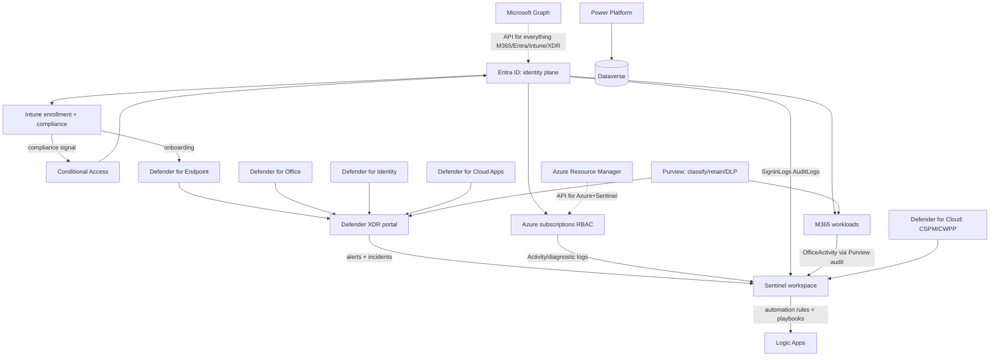

# 00 : The Microsoft Ecosystem Map

The complete top-level inventory of the Microsoft cloud universe this site must cover.
Every subject here has its own deep-dive doc (01-11) that fills in the smaller parts.

Convention: facts that churn (URLs, retirements, license names) are tagged `VERIFY` and must be
re-checked in the build phase against a live tenant and Microsoft Learn.

---

## 1. The thirteen subjects (our taxonomy)

| # | Subject | slug | One-liner | Deep doc |
|---|---|---|---|---|
| 1 | Entra / Identity | `entra` | Who can get in, to what, under which conditions | [01-entra-identity.md](01-entra-identity.md) |
| 2 | Intune / Endpoint management | `intune` | Devices and apps: enroll, configure, comply, patch | [02-intune-endpoint-management.md](02-intune-endpoint-management.md) |
| 3 | Defender XDR | `defender` | Detect and respond: endpoints, email, identities, cloud apps | [03-defender-xdr.md](03-defender-xdr.md) |
| 4 | Sentinel / SIEM+SOAR | `sentinel` | Collect everything, correlate, hunt, automate response | [04-sentinel.md](04-sentinel.md) |
| 5 | Azure platform | `azure` | Subscriptions, governance, infra, monitoring | [05-azure-platform.md](05-azure-platform.md) |
| 6 | Microsoft 365 admin & collab | `m365` | Tenant admin, Exchange, SharePoint, Teams, Office apps | [06-m365-admin-collab.md](06-m365-admin-collab.md) |
| 7 | Purview / Compliance & data governance | `purview` | Audit, discover, classify, protect, retain data | [07-purview-compliance.md](07-purview-compliance.md) |
| 8 | Power Platform & analytics | `power` | Low-code apps, flows, BI/Fabric, Copilot Studio | [08-power-platform.md](08-power-platform.md) |
| 9 | Windows cloud endpoints | `windows` | Windows 365, AVD, Dev Box, Universal Print | [09-windows-cloud-endpoints.md](09-windows-cloud-endpoints.md) |
| 10 | Automation / Graph / PowerShell | `automation` | Do it with code: Graph, PS modules, CLI, community tools | [10-automation-graph-powershell.md](10-automation-graph-powershell.md) |
| 11 | Licensing, tenancy & support | `licensing` | SKUs, tenants, sovereign clouds, support | [11-licensing-tenancy-support.md](11-licensing-tenancy-support.md) |
| 12 | MSP multi-tenant & hardening | `msp` | Running and hardening customer tenants at scale | [15-msp-hardening.md](15-msp-hardening.md) |
| 13 | Client troubleshooting toolbox | `toolbox` | On-device diagnostics: commands, logs, repair ladders | [16-client-troubleshooting-toolbox.md](16-client-troubleshooting-toolbox.md) |
| + | My Pages (end-user surfaces) | `mypages` | Self-service portals agents send users to | in 06 |

cmd.ms category -> our slug mapping: `Entra`->entra, `Intune`->intune, `Defender`->defender,
`XDR Sentinel`->sentinel, `Azure`->azure (except Sentinel entries -> sentinel), `Microsoft
365`->m365 (except Power* entries -> power, Windows 365 -> windows), `Purview`->purview,
`Power Platform`->power, `My Pages`->mypages, `General`->licensing or m365 case by case;
Lighthouse, Partner Center and CDX rows -> msp via overrides. No upstream rows map to
toolbox (all own content).

## 2. Portal atlas (the front doors)

Every major admin surface. `cmd` = existing cmd.ms command we import.

### Tier 1: the daily seven

| Portal | URL | cmd | Notes |
|---|---|---|---|
| Microsoft 365 admin center | `https://admin.microsoft.com` (moving to `https://admin.cloud.microsoft`) `VERIFY` | `admin` | tenant hub, users, licenses, service health |
| Entra admin center | `https://entra.microsoft.com` | `en` | all identity |
| Intune admin center | `https://intune.microsoft.com` | `in` | endpoint management |
| Defender portal | `https://security.microsoft.com` | `defender` | XDR + Sentinel unified SOC |
| Azure portal | `https://portal.azure.com` | `az` | everything ARM |
| Purview portal | `https://purview.microsoft.com` | `pu` | compliance + data governance (classic compliance portal retired) `VERIFY` |
| Exchange admin center | `https://admin.cloud.microsoft/exchange` (was `admin.exchange.microsoft.com`) `VERIFY` | `ex` | mail flow, mailboxes |

### Tier 2: workload admin centers

| Portal | URL | cmd |
|---|---|---|
| Teams admin center | `https://admin.teams.microsoft.com` | `teams` |
| SharePoint admin center | `https://admin.microsoft.com/sharepoint` (tenant-specific `*-admin.sharepoint.com`) | `sp` |
| OneDrive admin (folded into SPO) | `https://admin.onedrive.com` (legacy) | `one` |
| Power Platform admin center | `https://admin.powerplatform.microsoft.com` | `pp` |
| Power BI / Fabric admin | `https://app.powerbi.com/admin-portal` | `pbi` |
| M365 Apps admin center | `https://config.office.com` | `m365apps` |
| Teams Rooms Pro | `https://portal.rooms.microsoft.com` | `teamsrooms` |
| Security Copilot | `https://securitycopilot.microsoft.com` | `scp` |
| Windows 365 | `https://windows365.microsoft.com` | `win365` |
| Intune for Education | `https://intuneeducation.portal.azure.com` | `inedu` |
| M365 Lighthouse (MSP) | `https://lighthouse.microsoft.com` | `lh` |
| Partner Center | `https://partner.microsoft.com/dashboard` | `partner` |
| Defender for Cloud Apps (classic) | `https://portal.cloudappsecurity.com` (folded into Defender portal) `VERIFY` | `deca` |
| Entra admin GCC High | `https://entra.microsoft.us` | `eng` |
| Yammer / Viva Engage admin | `https://www.yammer.com/office365/admin` | `yam` |

### Tier 3: maker, developer and tool surfaces

| Portal | URL | cmd |
|---|---|---|
| Graph Explorer | `https://developer.microsoft.com/graph/graph-explorer` | `ge` |
| Azure Cloud Shell | `https://portal.azure.com/#cloudshell/` (also `shell.azure.com`) | `azshell` |
| Azure Resource Graph Explorer | portal blade `ArgQueryBlade` | `arg` |
| Power Apps maker | `https://make.powerapps.com` | `powerapps` |
| Power Automate maker | `https://make.powerautomate.com` | `pa` |
| Copilot Studio | `https://copilotstudio.microsoft.com` | `cps` |
| Azure DevOps | `https://dev.azure.com` | `dev` |
| Azure Data Explorer | `https://dataexplorer.azure.com` | `azkusto` |
| Azure Machine Learning | `https://ml.azure.com` | `azml` |
| Azure OpenAI / AI Foundry | `https://oai.azure.com/portal` (rebranding to AI Foundry `ai.azure.com`) `VERIFY` | `azoai` |
| Synapse Studio | `https://web.azuresynapse.net` | `synapse` |
| Data Factory studio | `https://adf.azure.com` | `adf` |
| CosmosDB Explorer | `https://cosmos.azure.com` | `cosmos` |
| AVD web client | `https://client.wvd.microsoft.com/arm/webclient/` (new: `windows.cloud.microsoft`) `VERIFY` | `avdweb` |
| Office customization tool | `https://config.office.com/deploymentsettings` | `oct` |
| CDX demo tenants | `https://cdx.transform.microsoft.com` | `cdx` |
| Microsoft Learn training | `https://learn.microsoft.com/training/` | `training` |

### Tier 4: end-user self-service (what the helpdesk sends people to)

| Portal | URL | cmd |
|---|---|---|
| My Account | `https://myaccount.microsoft.com` | `myaccount` |
| My Apps | `https://myapps.microsoft.com` | `myapps` |
| My Sign-ins / security info | `https://mysignins.microsoft.com/security-info` | `mymfa` |
| My Access (entitlement) | `https://myaccess.microsoft.com` | `myaccess` |
| My Groups | `https://myaccount.microsoft.com/groups` | `mygroups` |
| My Staff (delegated) | `https://mystaff.microsoft.com` | `mystaff` |
| SSPR | `https://passwordreset.microsoftonline.com` | `mypw` |
| Office home | `https://www.office.com` (moving to `m365.cloud.microsoft`) `VERIFY` | (add own) |
| Outlook web | `https://outlook.office365.com/mail/` | `mail` |
| Teams web | `https://teams.microsoft.com` | `teamsweb` |
| Copilot | `https://copilot.microsoft.com` | `cp` |
| Login page / device login | `login.microsoftonline.com`, `microsoft.com/devicelogin` | `l`, `dl` |

### Auth/plumbing endpoints worth documenting (not links to click)

`login.microsoftonline.com` (Entra sign-in), `login.microsoftonline.us` (GCC High/DoD),
`login.chinacloudapi.cn` (21Vianet), `device.login.microsoftonline.com`,
`enterpriseregistration.windows.net` (device reg), `enrollment.manage.microsoft.com` (Intune),
`autologon.microsoftazuread-sso.com` (seamless SSO), `graph.microsoft.com`,
`manage.office.com`, `outlook.office365.com` (EWS/IMAP/SMTP), `smtp.office365.com`,
`autodiscover.outlook.com`. These power the connectivity/runbook pages.

## 3. Sovereign clouds and environment matrix

| Cloud | Entra login | Azure portal | M365/Defender flavor | Notes |
|---|---|---|---|---|
| Commercial (global) | login.microsoftonline.com | portal.azure.com | *.microsoft.com | default |
| GCC | login.microsoftonline.com | portal.azure.com | GCC variants of PP/PBI (`*.powerbigov.us`, `gcc.admin.powerplatform.microsoft.us`) | US gov moderate, shares commercial identity plane |
| GCC High | login.microsoftonline.us | portal.azure.us | `security.microsoft.us`, `entra.microsoft.us`, `intune.microsoft.us`, `purview.microsoft.us` | ITAR |
| DoD | login.microsoftonline.us | portal.azure.us | `*.appsplatform.us`, `app.mil.powerbigov.us` | DoD IL5 |
| China (21Vianet) | login.partner.microsoftonline.cn | portal.azure.cn | `portal.partner.microsoftonline.cn` | operated by 21Vianet |

Data model: one record, `clouds:{}` map. cmd.ms ships ~30 separate `*g`/`*dod` commands; the
import pipeline folds them into their commercial twin where the mapping is 1:1 and keeps the
extra ids as aliases.

## 4. How the subjects interlock (the mental model)

Key one-way doors every engineer must know (these become "concept" cards):
- Entra ID is the identity plane for all clouds; nothing works without it.
- Intune compliance feeds Conditional Access; CA is the enforcement point.
- MDE onboarding can be driven by Intune; MDE security settings management can flow back
  into unmanaged devices.
- Sentinel sits on a Log Analytics workspace; billing and retention are Azure Monitor
  concepts. The SOC experience now lives in the Defender portal (Azure-portal Sentinel
  experience retired 2026 `VERIFY`).
- Purview audit is the master activity feed for M365 (OfficeActivity in Sentinel).
- Two API planes: Microsoft Graph (M365/Entra/Intune/XDR) and ARM (Azure/Sentinel
  management). PowerShell modules split the same way.

## 5. Cross-cutting registries the site needs (shared data, not per-subject)

1. **RBAC role directory**: Entra directory roles (~100), Azure built-in roles (subset that
   matters), Defender XDR unified RBAC roles, Sentinel workspace roles, Exchange/Teams/SPO
   admin roles, Intune scope tags/roles. Each record references role ids from this registry.
2. **License/SKU registry**: E3/E5/F1/F3, Business Basic/Standard/Premium, EMS E3/E5, Entra
   P1/P2 + Suite, Intune P1/P2/Suite, Defender per-product plans, Sentinel ingestion (not a
   SKU), Copilot add-ons. Feature -> minimum SKU matrix lives in doc 11.
3. **PowerShell module registry**: Microsoft.Graph, ExchangeOnlineManagement,
   MicrosoftTeams, PnP.PowerShell, Az, Maester, etc. with install commands and auth patterns.
4. **KQL table registry**: table name -> product -> what is in it -> sample query.
5. **Error-code registries**: AADSTS sign-in errors, Intune enrollment errors (0x801c...),
   Exchange NDR codes (5.x.x), Teams/OneDrive client error surfaces.
6. **Docs URL patterns**: `learn.microsoft.com/{entra|defender-xdr|azure/sentinel|intune|
   microsoft-365|purview|power-platform|graph|powershell}` roots for auto-suggesting doc links.

## 6. Record-count budget (rough sizing for the data files)

| Subject | cmd.ms imported | own additions target v1 | settings-encyclopedia pages |
|---|---|---|---|
| entra | ~60 | +40 | later |
| intune | ~25 | +35 | later |
| defender | ~70 | +30 | phase 4 |
| sentinel | ~5 | +45 | phase 4 (flagship) |
| azure | ~90 | +20 | no |
| m365 (+mypages) | ~70 | +40 | later |
| purview | ~40 | +15 | later |
| power | ~20 | +10 | no |
| windows | ~5 | +15 | no |
| automation | ~5 | +25 | n/a (library) |
| licensing | ~6 | +20 | matrix |
| msp | ~6 | +30 | hardening baseline |
| toolbox | 0 | +40 | n/a (tools/concepts) |
| **total** | **~355** | **~365** | |

~720 command records at v1, plus KQL (60), PS snippets (60), runbooks (25) and a
synonym registry (~100 terms) so acronym searches (AIR, ZAP, GDAP, PRT...) resolve.
